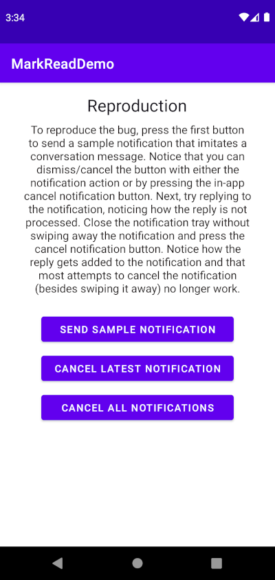
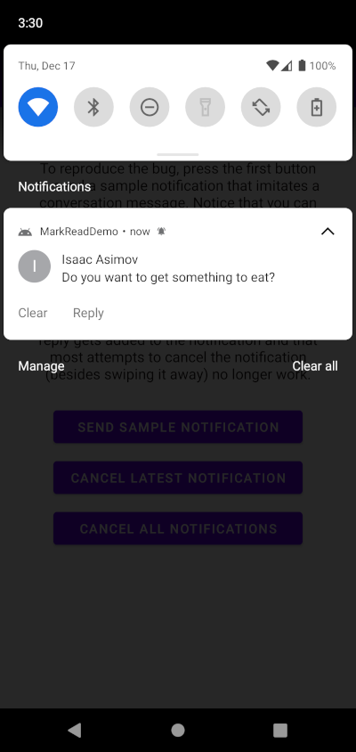
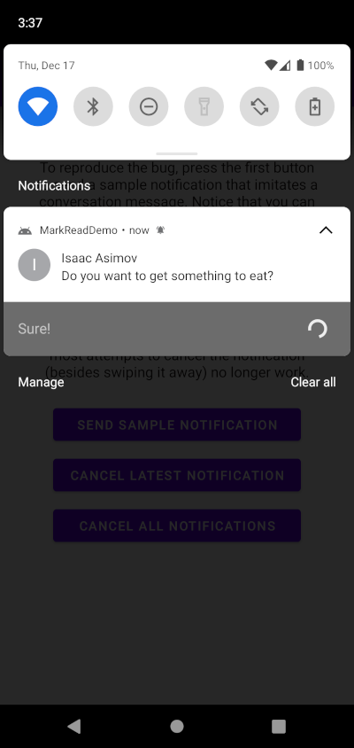
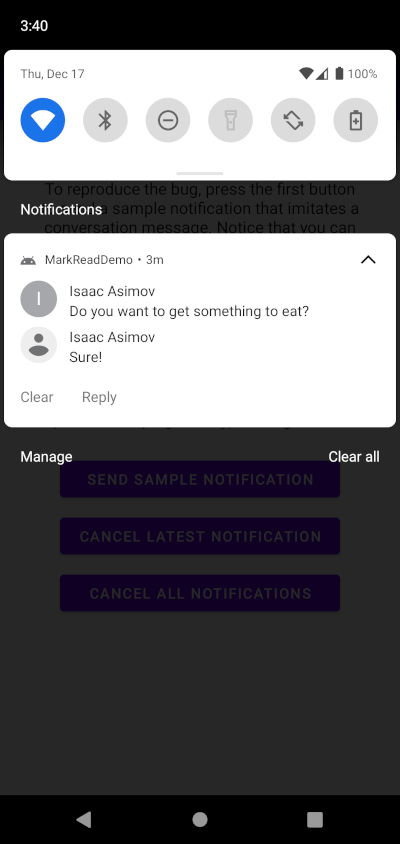

# MarkReadDemo
A reproduction of Android's `NotificationManagerCompat.cancel()` unexpected behavior

This demo was created as a result of looking into a [Signal Messenger bug](https://github.com/signalapp/Signal-Android/issues/9410). 
In short, attempting  to cancel a notification while it is processing an inline reply fails, 
causing the reply to be psuedo processed with subsequent attempts to cancel the notification also failing. 
In practical terms, this means that Signal's "Mark Read" button fails to work after inline replying to the message. 

## Example

Pressing 'Send Sample Notification' creates and sends a notification using `NotificationManagerCompat.notify(Id id, NotificationBuilder builder)` 
(Hereafter `NotificationManager` refers to `NotificationManagerCompat`).
The notification has a 'Clear' and a 'Reply' action. 
The receiver for the 'Clear' action runs `NotificationManager.cancel(id)` pulling the id from the intent of the action. The 'Reply' action does nothing. 

At this point, clearing the notification (using either the action or the app buttons) works as expected. 
Now an inline reply is sent. It is not procesed or added to the notification because its recievers's `onReceive` is purposelly left blank. 

At this point the notification is attempted to be cleared by using one of the clear buttons in the app. 
They call `NotificationManager.clear(Id id)` and `NotificationManager.clearAll()` repectively. 
The notification is not cleared and instead the reply is processed and added to the notification. 

Now the notification cannot be cleared by `NotificationManager` at all and can apparently only be cleared by the user swiping away the notification. 
Because `NotificationManager` cannot cancel the notification, the 'Clear' action no longer works. This situation is analogous to the bug faced by Signal. 

## Other unknowns and caveats

### Unexpected processing of the reply
After cancelling the notification, and sometimes initially after the reply, the reply is added to the notification. 
This is reproducible on the first (and sometimes subsequent) notification sent by a `NotificationManager`, 
so this demo creates and cancels five notifications to get around this behavior.
From my understanding of the [documentation](https://developer.android.com/training/notify-user/build-notification#messaging-best-practices), 
the reply should not be added unless the notification is updated with 'MessagingStyle.addMessage()' or another updating function is called. 
I've noticed that the `Person` is the same as the sender (Isaac Asimov) and that ocassionally the reply will maintain the underline of the input text. 

### Interference from Foreground Services
One possible explanation for this behavior is described in the [documentation]( https://developer.android.com/reference/android/app/NotificationManager?hl=en#cancel(java.lang.String,%20int) ) for `NotificationManager.cancel(Id id)`.

> If the notification does not currently represent a Service#startForeground(int, Notification), 
> it will be removed from the UI and live notification listeners will be informed so they can remove the notification from their UIs.

If somehow the notification represented a foreground service it may not wish to be cancelled. 
However, as there are no foreground services being used in this demo (and no way to stop one), it is still seems unexpected that this behavior is occurring. 

